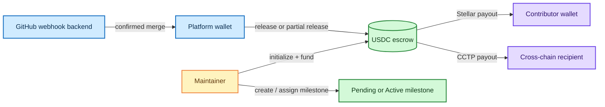

# Trustless-OSS Soroban Contract

[](https://github.com/Trustless-OSS/Toss-Contract/actions/workflows/rust.yml)
[](https://www.rust-lang.org/)
[](https://soroban.stellar.org/)

Trustless-OSS is a Soroban smart contract for GitHub-integrated open-source bounties. It holds a repository's USDC escrow, reserves funds for milestones, and releases payouts when the platform confirms that work is complete.

The contract is designed to be called by a backend that listens to GitHub events. The maintainer controls funding and milestone setup; the platform wallet executes completed payouts.

## What is in this repository

```text
.
├── Cargo.toml                 # Rust workspace configuration
├── Cargo.lock                 # Locked dependency versions
├── .github/workflows/rust.yml # Build and test CI
├── trustless-oss/
│   ├── Cargo.toml             # Contract crate
│   └── src/
│       ├── lib.rs             # Contract entry points and payout logic
│       ├── types.rs           # Escrow, milestone, and payout types
│       ├── storage.rs         # Persistent Soroban storage helpers
│       ├── auth.rs            # Maintainer, platform, and active checks
│       ├── events.rs          # Contract event emitters
│       ├── error.rs           # Contract error codes
│       └── test.rs            # Unit and integration-style contract tests
└── docs/
    ├── arch.md               # Architecture, diagrams, and state flows
    └── contract-spec.md      # Detailed API, data model, and invariants
```

Read [the architecture guide](docs/arch.md) for the system diagrams and [the contract specification](docs/contract-spec.md) for the complete entry-point and data-model reference.

## Quick start

### Prerequisites

- Rust stable with Cargo
- The `wasm32-unknown-unknown` target for optimized contract builds
- The [Stellar CLI](https://developers.stellar.org/docs/tools/developer-tools/stellar-cli) for Soroban build and deployment commands

Check the local Rust toolchain:

```bash
rustc --version
cargo --version
```

### Clone and enter the project

```bash
git clone https://github.com/Trustless-OSS/Toss-Contract.git
cd Toss-Contract
```

### Build and test

```bash
# Compile the workspace
cargo build --workspace

# Run all contract tests
cargo test --workspace

# Check formatting without changing files
cargo fmt --all -- --check
```

To build the optimized WebAssembly artifact directly:

```bash
rustup target add wasm32-unknown-unknown
cargo build -p trustless-oss --target wasm32-unknown-unknown --release
```

The resulting artifact is `target/wasm32-unknown-unknown/release/trustless_oss.wasm`.

The Stellar CLI can also build the contract with:

```bash
stellar contract build
```

## Contract flow



## Deploy and invoke

Deployment requires a funded Stellar account, a network configuration, and the appropriate USDC SAC address. Keep secret keys outside the repository.

```bash
# Build the optimized WASM first
stellar contract build

# Deploy to testnet; replace the placeholders
stellar contract deploy \
  --wasm target/wasm32-unknown-unknown/release/trustless_oss.wasm \
  --network testnet \
  --source <deployer_keypair>
```

After deployment, initialize the single escrow instance:

```bash
stellar contract invoke \
  --id <contract_id> \
  --fn initialize \
  --arg <repo_id> \
  --arg <maintainer_address> \
  --arg <platform_address> \
  --arg <usdc_token_address> \
  --network testnet \
  --source <initializer_keypair>
```

The first initializer becomes the stored admin. Later initialization attempts require that stored admin and are rejected once the escrow exists. See [deployment and invocation details](docs/contract-spec.md#deployment-and-integration) before using a real account.

## Contributing

1. Fork the repository and create a focused branch from `main`.
2. Make the smallest change that addresses the issue.
3. Add or update tests for contract behavior, authorization, balances, and events.
4. Run the same checks used by CI:

   ```bash
   cargo fmt --all -- --check
   cargo build --workspace --verbose
   cargo test --workspace --verbose
   ```

5. Open a pull request against `main` with a concise description of the behavior change and verification performed.

For contract-specific design constraints, balance invariants, error codes, and known limitations, read [the contract specification](docs/contract-spec.md). Please do not commit secret keys, deployed-account credentials, or private environment files.

## License

No license file is currently included in this repository. Add or confirm a project license before distributing the contract outside the repository.
