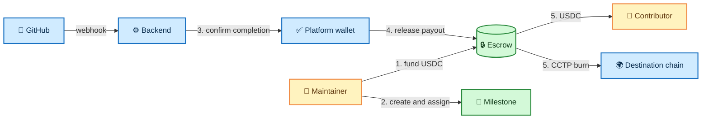

# 🪙 TOSS — Trustless Open-Source Sponsorship

<div align="center">

**A Soroban smart contract that turns repository funding into transparent, milestone-based USDC payouts.**

[](https://github.com/Trustless-OSS/Toss-Contract/actions/workflows/rust.yml)
[](https://www.rust-lang.org/)
[](https://soroban.stellar.org/)
[](https://stellar.org/)
[](LICENSE)

[Quick start](#-quick-start) · [How it works](#-how-it-works) · [Contract API](docs/contract-spec.md) · [Architecture](docs/arch.md) · [Contributing](docs/contributing.md)

</div>

---

## ✨ What is TOSS?

TOSS holds a repository's USDC in escrow, reserves rewards for open-source milestones, and releases payouts only after the platform confirms the work is complete. It is designed for a backend that listens to GitHub activity and coordinates the trusted platform release step.

| 👤 Who | ✅ What they can do |
| --- | --- |
| **Maintainer** | Initialize an escrow, add or withdraw available USDC, and manage milestones. |
| **Platform wallet** | Release full or partial payouts after completion is confirmed. |
| **Contributor** | Receives USDC on Stellar or at a CCTP recipient address on a supported destination chain. |
| **Backend** | Connects GitHub webhooks to the contract workflow; it is not part of this repository. |

## 🌈 Highlights

- 🔒 **USDC escrow** — funds stay in the contract until an authorized action moves them.
- 🎯 **Milestone reservations** — assigned rewards cannot be withdrawn or double-spent.
- 💸 **Full and partial payouts** — release the reward, or return an unused remainder to the pool.
- 🌍 **Cross-chain CCTP payouts** — burn Stellar USDC for a recipient on another supported CCTP domain.
- 🛡️ **Clear authorization** — maintainer controls funding and milestones; platform controls payouts.
- 📣 **On-chain events** — state-changing operations emit typed event topics.
- 🧪 **Tested contract logic** — authorization, balances, storage, and payout paths are covered by the workspace test suite.

## 🧭 How it works



### Milestone lifecycle

```text
🆕 Pending ── assign contributor ──▶ ⚡ Active ── release ──▶ ✅ Released
                                            │
                                            ├── partial release ──▶ ✅ Released
                                            └── cancel ──────────▶ 🚫 Cancelled

🆕 Pending ── cancel ───────────────────────────────────────────▶ 🚫 Cancelled
```

> 💡 Creating a milestone reserves its full reward. A cancellation returns the entire reward to the available pool; a partial release returns only the unpaid remainder.

## ⚡ Quick start

### 1. Prerequisites

- [Rust stable](https://www.rust-lang.org/tools/install) and Cargo
- `wasm32-unknown-unknown` target for optimized WebAssembly builds
- [Stellar CLI](https://developers.stellar.org/docs/tools/developer-tools/stellar-cli) for Soroban builds and deployment

```bash
rustc --version
cargo --version
stellar --version
```

### 2. Clone, build, and test

```bash
git clone https://github.com/Trustless-OSS/Toss-Contract.git
cd Toss-Contract

# Run the complete contract test suite
cargo test --workspace

# Check formatting
cargo fmt --all -- --check

# Build an optimized WebAssembly artifact
rustup target add wasm32-unknown-unknown
cargo build -p trustless-oss --target wasm32-unknown-unknown --release
```

The optimized contract is written to:

```text
target/wasm32-unknown-unknown/release/trustless_oss.wasm
```

## 🧰 Contract at a glance

| Action | Entry point | Authorization |
| --- | --- | --- |
| 🏗️ Create escrow | `initialize` | Maintainer on the first call |
| 💰 Fund or withdraw | `deposit_funds` / `withdraw_funds` | Maintainer |
| 🎯 Manage milestones | `create_milestone`, `assign_contributor`, `reassign_contributor`, `cancel_milestone` | Maintainer |
| 💸 Pay contributors | `release_funds` / `partial_release` | Platform wallet |
| 🔎 Read contract state | `get_escrow`, `get_milestone`, `get_balance`, `list_milestones` | Public |

Amounts use token base units. For a 7-decimal USDC token, `10_000_000` base units equals **1 USDC**.

## 🌍 Cross-chain payouts with CCTP

TOSS can pay contributors beyond Stellar through **CCTP**. When a milestone is assigned a CCTP target, a full or partial release calls CCTP's `deposit_for_burn` flow: USDC is burned on Stellar and can be redeemed for the specified recipient on the destination chain.

```text
🔒 Stellar USDC escrow → 🔥 CCTP burn → 📡 attestation and redemption → 🌍 recipient on destination chain
```

Set the contributor target to `PayoutTarget::Cctp(destination_domain, recipient)`, where `recipient` is the destination wallet encoded as 32 bytes. TOSS validates that the domain is supported and that the recipient is not empty before it initiates the burn.

| Destination | CCTP domain |
| --- | ---: |
| Ethereum | `0` |
| Avalanche | `1` |
| Arbitrum | `3` |
| Solana | `5` |
| Base | `6` |
| Polygon PoS | `7` |
| Starknet | `25` |

> ⚠️ A CCTP release initiates the cross-chain burn. The destination-side recipient receives USDC only after the normal CCTP attestation and redemption process completes.

## 🚀 Deploy to testnet

> ⚠️ Keep secret keys outside this repository. The contract itself does not read environment variables; deployment and backend configuration belong to your caller environment.

```bash
# Build with the Stellar CLI
stellar contract build

# Deploy the WASM — replace placeholders with your account and network setup
stellar contract deploy \
  --wasm target/wasm32-unknown-unknown/release/trustless_oss.wasm \
  --network testnet \
  --source <deployer_keypair>
```

Initialize the deployed contract once:

```bash
stellar contract invoke \
  --id <contract_id> \
  --fn initialize \
  --arg <repo_id> \
  --arg <maintainer_address> \
  --arg <platform_address> \
  --arg <usdc_token_address> \
  --network testnet \
  --source <initializer_keypair>
```

The first initializer becomes the stored admin. Later initialization attempts are rejected once the escrow exists.

## 🗂️ Project map

```text
trustless-oss/src/
├── lib.rs       # Contract entry points and payout routing
├── types.rs     # Escrow, milestone, and payout data types
├── storage.rs   # Persistent storage keys and TTL management
├── auth.rs      # Maintainer and platform authorization checks
├── events.rs    # State-change event topics
├── error.rs     # Contract error codes
└── test.rs      # In-memory contract tests
```

## 📚 Documentation

- 🧩 [Architecture guide](docs/arch.md) — system context, storage, state transitions, and authorization boundaries.
- 📖 [Contract specification](docs/contract-spec.md) — all entry points, data model, errors, deployment details, and known limitations.
- 🤝 [Contributing guide](docs/contributing.md) — local workflow, branch names, commits, and pull-request expectations.

## 🤝 Contributing

Contributions are welcome! Please read the [contributing guide](docs/contributing.md), keep changes focused, and run the verification commands before opening a pull request.

```bash
cargo fmt --all -- --check
cargo build --workspace
cargo test --workspace
```

---

<div align="center">

Built for transparent open-source funding on <a href="https://stellar.org/">Stellar</a>. ✨

</div>
