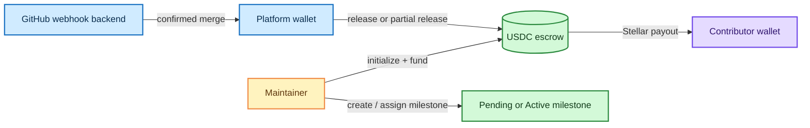

# TOSS Soroban Contract

[](https://github.com/Trustless-OSS/Toss-Contract/actions/workflows/rust.yml)
[](https://www.rust-lang.org/)
[](https://soroban.stellar.org/)

TOSS is a Soroban smart contract for Trustless-OSS  for replacing existing third party service. It holds a repository's USDC escrow, reserves funds for milestones, and releases payouts when the platform confirms that work is complete.

The contract is designed to be called by a backend that listens to GitHub events. The maintainer controls funding and milestone setup; the platform wallet executes completed payouts.

## What is in this repository

```text
.
├── Cargo.toml                
├── Cargo.lock                
├── .github/workflows/rust.yml 
├── trustless-oss/
│   ├── Cargo.toml             
│   └── src/
│       ├── lib.rs            
│       ├── types.rs         
│       ├── storage.rs        
│       ├── auth.rs            
│       ├── events.rs        
│       ├── error.rs
│       └── test.rs          
└── docs/
    ├── arch.md              
    └── contract-spec.md    
```

Read [the architecture guide](docs/arch.md) for the system diagrams and [the contract specification](docs/contract-spec.md) for the complete entry-point and data-model reference.

## Quick start

### Prerequisites

- Rust stable with Cargo
- The `wasm32-unknown-unknown` target for optimized contract builds
- The [Stellar CLI](https://developers.stellar.org/docs/tools/developer-tools/stellar-cli) for Soroban build and deployment commands

Check the local Rust toolchain:

```bash
rustc --version
cargo --version
```

### Clone and enter the project

```bash
git clone https://github.com/Trustless-OSS/Toss-Contract.git
cd Toss-Contract
```

### Build and test

```bash
# Compile the workspace
cargo build --workspace

# Run all contract tests
cargo test --workspace

# Check formatting without changing files
cargo fmt --all -- --check
```

To build the optimized WebAssembly artifact directly:

```bash
rustup target add wasm32-unknown-unknown
cargo build -p trustless-oss --target wasm32-unknown-unknown --release
```

The resulting artifact is `target/wasm32-unknown-unknown/release/trustless_oss.wasm`.

The Stellar CLI can also build the contract with:

```bash
stellar contract build
```

## Contract flow



## Deploy and invoke

Deployment requires a funded Stellar account, a network configuration, and the appropriate USDC SAC address. Keep secret keys outside the repository.

```bash
# Build the optimized WASM first
stellar contract build

# Deploy to testnet; replace the placeholders
stellar contract deploy \
  --wasm target/wasm32-unknown-unknown/release/trustless_oss.wasm \
  --network testnet \
  --source <deployer_keypair>
```

After deployment, initialize the single escrow instance:

```bash
stellar contract invoke \
  --id <contract_id> \
  --fn initialize \
  --arg <repo_id> \
  --arg <maintainer_address> \
  --arg <platform_address> \
  --arg <usdc_token_address> \
  --network testnet \
  --source <initializer_keypair>
```

The first initializer becomes the stored admin. Later initialization attempts require that stored admin and are rejected once the escrow exists. See [deployment and invocation details](docs/contract-spec.md#deployment-and-integration) before using a real account.


