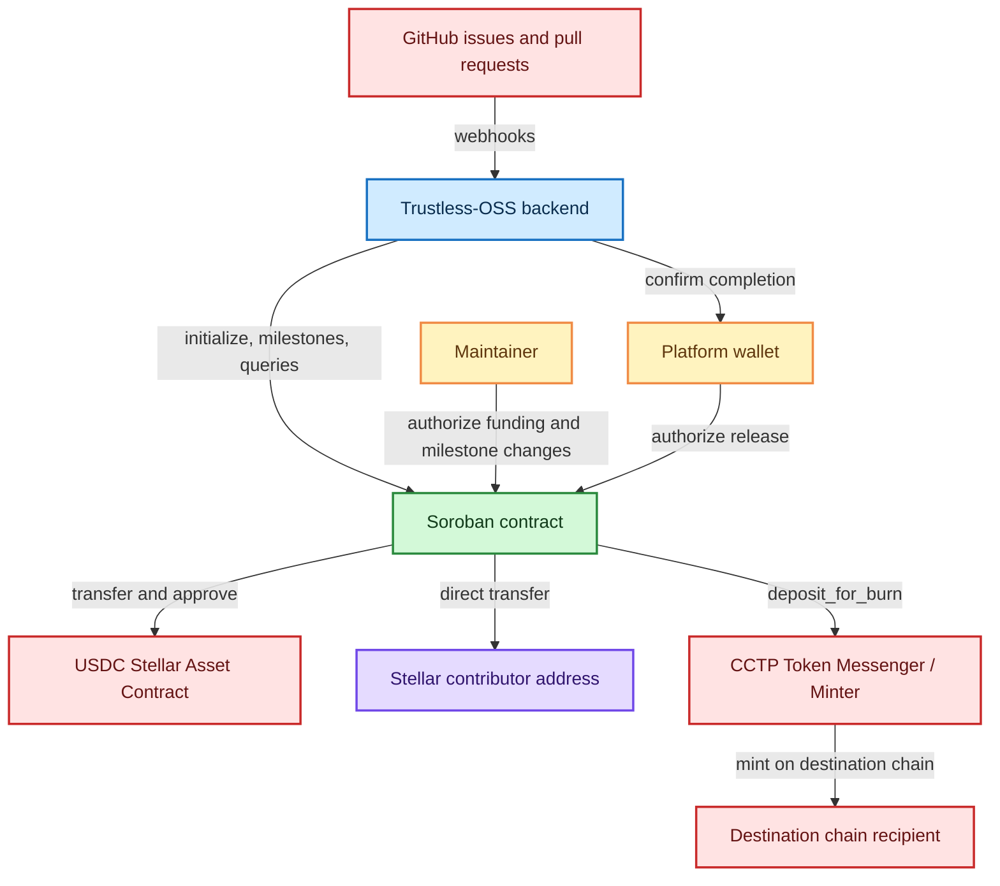
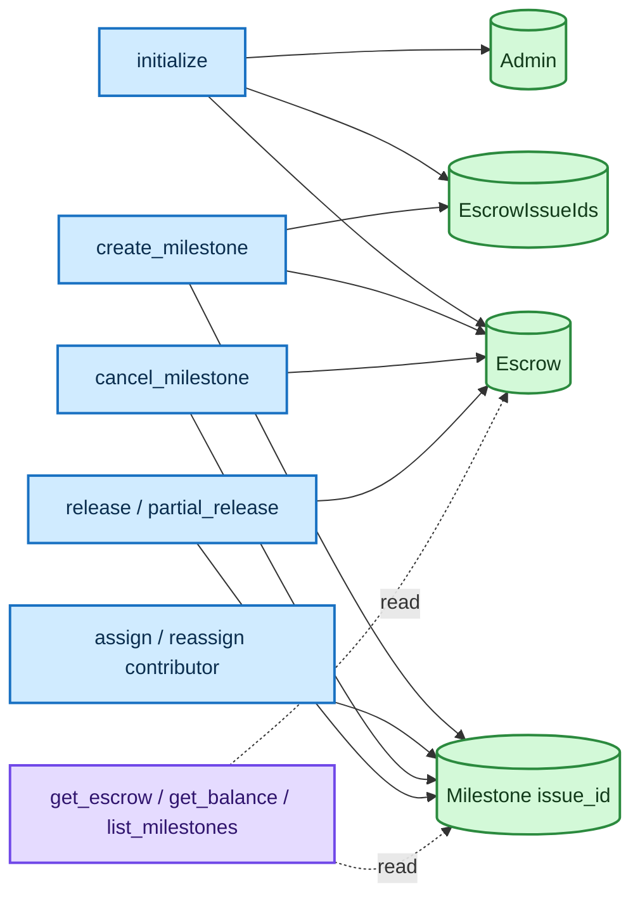
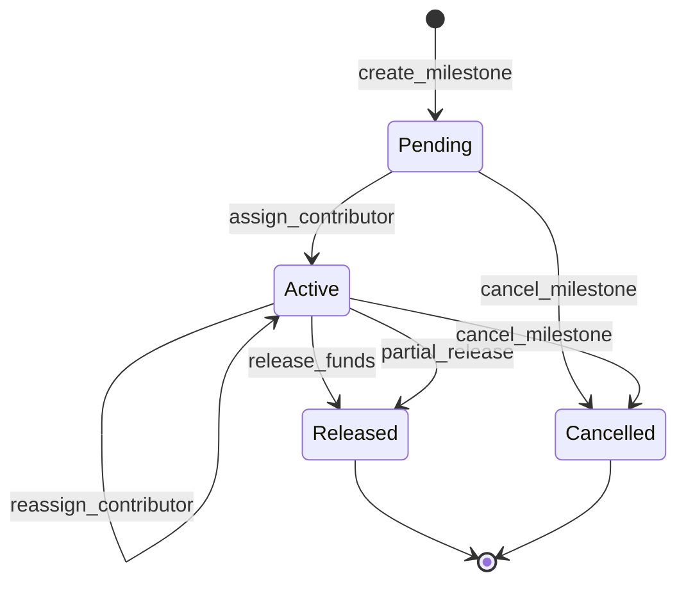
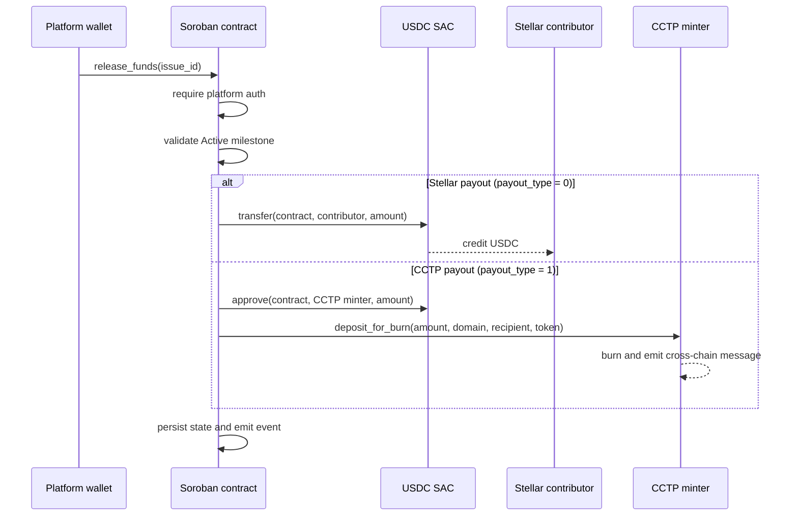

# Trustless-OSS Contract Architecture

This document describes the current implementation in `trustless-oss/src`. The contract stores one repository escrow per deployed contract instance. A backend can deploy separate instances when it needs separate isolation boundaries.

## System context

## Module responsibilities

| Module | Responsibility |
| --- | --- |
| `lib.rs` | Contract entry points, escrow/milestone transitions, token transfers, and CCTP payout dispatch. |
| `types.rs` | `EscrowState`, `Milestone`, `MilestoneStatus`, `PayoutTarget`, and `BalanceInfo` contract types. |
| `storage.rs` | Persistent keys, reads/writes, issue-ID indexing, and storage TTL extension. |
| `auth.rs` | Soroban authorization checks for the maintainer, platform, and active escrow state. |
| `events.rs` | Typed event topics emitted after state-changing operations. |
| `error.rs` | Stable numeric `ContractError` values returned by entry points. |
| `test.rs` | In-memory Soroban environment, token mocks, authorization tests, and CCTP payout tests. |

## State and storage

All application keys are stored in Soroban persistent storage and writes extend their TTL to the configured `100_000` minimum and maximum values. `EscrowIssueIds` is the index used by `list_milestones`; each milestone is stored separately under its issue ID.

The deployed contract has one `EscrowState`, not a map of escrow IDs. Its state tracks:

- `total_deposited`: cumulative funds added to the contract balance.
- `reserved`: rewards belonging to pending or active milestones.
- `total_released`: cumulative amount paid to contributors.
- `available`: derived as `total_deposited - reserved - total_released`.

## Milestone lifecycle

Creating a milestone reserves its full reward. Assignment changes the payout target and status but does not change the reserved amount. A full release pays the full reward; a partial release pays the requested amount and makes the remainder available again. Cancellation un-reserves the full reward without transferring funds.

## Payout sequence

`PayoutTarget.payout_type` is `0` for a Stellar address, `1` for CCTP, and `2` for an unset contributor. CCTP releases validate the destination domain, reject a zero recipient, and require an amount divisible by 10 to avoid precision loss.

## Authorization boundaries

| Operation | Required authorization |
| --- | --- |
| First `initialize` | The maintainer authorizes and becomes the stored admin. |
| Later `initialize` calls | The stored admin authorizes; the existing escrow still prevents reinitialization. |
| `deposit_funds`, `withdraw_funds` | Maintainer. |
| `create_milestone`, `assign_contributor`, `reassign_contributor`, `cancel_milestone` | Maintainer. |
| `release_funds`, `partial_release` | Platform wallet. |
| Query entry points | No explicit caller authorization. |

## Related documentation

- [Repository README](../README.md) — installation, build, test, deployment, and contribution workflow.
- [Contract specification](contract-spec.md) — complete entry-point reference, error codes, events, and known limitations.
- [Contributing guide](contributing.md) — branch names, commit messages, and pull request expectations.
